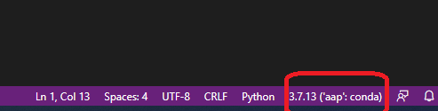

*************************************************
Setting up your analytics machine
*************************************************

This course will be a blend of analytics and software engineering for analytics. As such, I will start by helping you get your computer set up as your *analytics machine* for this course. You will:

* Install several pieces of software including the Anaconda Python distribution, one or more IDEs, git and GitHub Desktop, a good text editor.
* learn about conda virtual environments and create one for this course based on a YAML configuration file that I've provided.
* create a free GitHub account if you don't already have one.
* create a free Kaggle account if you don't already have one.

Overview of computing platform options
=======================================

A look back at the pcda course
------------------------------

In the `pcda course we used a virtual machine running Lubuntu Linux <http://www.sba.oakland.edu/faculty/isken/courses/mis5470/pcda_vm.html>`_. We did that for a few reasons:

* Many of these tools are totally new to students in the pcda class.
* I wanted everyone to have the same computing environment with all necessary software pre-installed.
* Learning Linux was one of the learning objectives for the course.

However, I also encouraged students in that class to install the major pieces of software (R, R Studio, Anaconda Python, a good text editor) on their *host operating system* (Windows or Mac or even Linux). I did this to emphasize that these tools are all freely available and cross-platform. By doing this, you also had multiple ways to access the software used in the pcda course. Finally, I wanted students to become familiar with installing and maintaining commonly used analytics software tools.

Choices for the current aap course
----------------------------------

My plan for this course is that most, if not all, students will be installing and using all of the necessary software for the course on their host operating system. This could be Windows, Mac or Linux. I'm doing all of the course development for this course in Windows and all of the screencasts will be Windows based. There are several reasons for this:

* Learning Linux is not one of the learning objectives for the course. As you'll see, Linux knowledge is certainly useful and even in the Windows/Mac worlds, we need to know some Linux. However, you've already had sufficient exposure to Linux through the pcda class. Even if you didn't take the pcda course and have zero Linux knowledge, you should be able to self-learn the little bit needed as we go.
* We get better performance if we don't have to use a VM as we can access all of the system RAM and CPUs.
* Many of you will be working or are working in corporate environments in which Windows or Mac OS is used. I want you to see that we can do analytics work in Windows just fine. In fact, the VS Code IDE is becoming quite popular and is something you could use (more on this below).

Below, I'll be provide guidance on getting all of the course software installed in Windows. If you are a Mac user, it's usually pretty simple to adapt the instructions (e.g. it's often just selecting the correct installer).

However, I will also be providing a Lubuntu Linux based VM for this course, just as I did for the pcda course. In fact,
you can just `go to the pcda coursweb virtual machine page <http://www.sba.oakland.edu/faculty/isken/courses/mis5470/pcda_vm.html>`_ and follow the instructions to download and install it. This might be useful if the only computer you have is a work machine that has limited capability for new software installs. Of course, to use the VM you do need to be able to install VirtualBox. If you do decide to use the pcda VM for this
course (which I do **not** recommend), you will have to create a new conda virtual environment - instructions for that are provided below. 

Again, you do **NOT** need to use a VM for this course. I won't be. I'll be using Windows.

Software installs
==================

Installing Anaconda Python
--------------------------

You’ll be downloading the Individual Edition.

https://www.anaconda.com/products/individual#download-section

Click the big Download button and you’ll get taken to a section with the 64bit Windows installer (or Mac). Install it. Here's a screencast I made that walks you through the process of installing and launching Anaconda (a few different ways).

* `SCREENCAST: Installing and Getting Started with Anaconda Python <https://youtu.be/Z5O6yORGSwg>`_

* `Getting Started with Anaconda Individual Edition <https://docs.anaconda.com/anaconda/user-guide/?utm_source=anaconda.com&utm_medium=individual-get-started>`_

Getting conda ready to use virtual environments within Jupyter
---------------------------------------------------------------

This has been a source of confusion/frustration over the years for many Jupyter users. I finally
wrote up a `blog post to remind myself the best way to do this <https://bitsofanalytics.org/posts/jupyter-conda-envs/jupyter_conda_envs.html>`_. I encourage you to read through it before continuing with this step.

* `SCREENCAST: Using conda virtual environments with Jupyter Lab <https://youtu.be/2KJHLlPqqDs>`_

In order for Jupyter to recognize different conda virtual environments, you may need to `install
some extensions <https://docs.anaconda.com/anaconda/user-guide/tasks/use-jupyter-notebook-extensions/>`_. Just start a open an Anaconda Prompt shell and do the following::

    > conda install nb_conda_kernels

You'll only do this **one time**. From then on, Jupyter will be able to recognize different
conda virtual environments. Again, see my blog post mentioned above for more details.

Setting up our conda virtual environment
----------------------------------------

After installing Anaconda Python on your computer, the next thing you'll do is to create a new conda virtual environment based on a (YAML) configuration file that I've created. Back in the pcda class we learned a bit about conda virtual environments and used one called ``datasci`` that I created on the pcda VM. If you want an overview on conda virtual environments as well as the details, see:

* `Getting started with Python environments (using Conda) <https://towardsdatascience.com/getting-started-with-python-environments-using-conda-32e9f2779307>`_
* `Overview from Anaconda User Guide <https://conda.io/projects/conda/en/latest/user-guide/concepts/environments.html>`_
* `Managing Environments page with all the details <https://conda.io/projects/conda/en/latest/user-guide/tasks/manage-environments.html>`_

For this course, I've created a virtual environment called ``aap`` (of course). Here's a link to the YAML config file that defines this environment:

* `Download aap.yml <https://drive.google.com/file/d/1HrE6_9ZhK3xqpGS0Z_QDAoBraMbntCA8/view?usp=sharing>`_

.. note::

   If you decide to use the pcda VM, you'll still want to create the ``aap`` conda virtual env as it installs some software that I didn't install in the ``datasci`` virtual env I created for the pcda class.

After downloading it, put it somewhere convenient in your filesystem and open up an Anaconda Prompt (I demo opening an Anaconda command prompt in the `Installing and Getting Started with Anaconda Python screencast <https://youtu.be/Z5O6yORGSwg>`_). You should see ``(base)`` to the left of the prompt. This indicates that you are in the base Anaconda environment. In general, we don't want to work in the base environment. We want to work in a virtual environment of our own creation so that if we mess things up we don't end up having to reinstall Anaconda Python. Change directories in the Anaconda command prompt to where ever you put the ``aap.yml`` file. If you're in this class I'm sure you know how to do a ``cd`` (yes, same in Windows as it is in Linux). 

Let's look at the ``aap.yml`` file. It's pretty self-explanatory (other than maybe ``channels``). See the `Creating an environment file manually <https://docs.conda.io/projects/conda/en/latest/user-guide/tasks/manage-environments.html#create-env-file-manually>`_ for details on YAML environment files for conda. The ``channels`` section is telling conda where to look to find software to install. The order matters. In ``aap``, conda will first look in the default Anaconda software channel and if not found, will look in a channel called ``conda-forge``. You can think of it as the CRAN for user contributed packages for the Anaconda world. We'll learn more about dependency management throughout the course. After we create our new ``aap`` environment, we'll have all of the packages installed that are in our ``dependencies`` section (and a whole lot more since these packages have their own dependencies).

.. code::

	name: aap
	channels:
	  - defaults
	  - conda-forge
	dependencies:
	  - python=3.9
	  - numpy
	  - pandas
	  - scipy
	  - scikit-learn
	  - matplotlib
	  - seaborn
	  - ipykernel
	  - statsmodels
	  - sphinx
	  - myst-parser
	  - cookiecutter
	  - pillow
	  - python-graphviz
	  - openpyxl
	  - xlsxwriter
	  - pip
	  - pip:
		- simpy
		- networkx
		- us

* `SCREENCAST: Creating and using the aap conda virtual environment <https://youtu.be/XIddGgcH9U8>`_ (13:21)

I've created a screencast to guide you through the steps needed. I encourage you to watch it as I also will show you where these conda virtual *envs* live on your computer and show how they lead to multiple *Python interpreters*. Understanding this will make using IDEs like PyCharm and VSCode, easier.

To actually create the new environment, run the following command at the Anaconda prompt. See `Creating an environment from an environment.yml file <https://docs.conda.io/projects/conda/en/latest/user-guide/tasks/manage-environments.html#creating-an-environment-from-an-environment-yml-file>`_ in the Management Environments section of the docs. Obviously, our file is called ``aap.yml``.

.. code::

   conda env create -f aap.yml

Then, to activate the new environment:

.. code::

   conda activate aap

Note that ``(base)`` changes to ``(aap)``. 

The only reason that you'll ever need to activate the ``aap`` environment from an Anaconda prompt is if you need to install some additional software into that virtual environment. The following note is **important**.

.. note::

    When we use Jupyter Lab, you'll still be typing ``jupyter lab`` from the base environment and then changing the kernel to use the ``aap`` virtual environment from within Jupyter Lab. Similarly, when we use an IDE like PyCharm or VSCode, we will tell it which conda virtual environment to use.

    

IDE options
-----------

While we will be using Jupyter Notebooks quite a bit (comes with Anaconda Python distro), we will also be using an IDE, especially for longer and more complex programs and when we want a visual debugger. There are several high quality IDEs for Python that are freely available. I will suggest two and you can decide what you want to do. If you are an experienced programmer and already have a development environment setup that you like (e.g. a good text editor and running Python from the command line), feel free to do that. I don't care what IDE you use. I will be demonstrating some things in class like using the integrated version control capabilities of an IDE or using the visual debugger, but it's not critical that you be using the same IDE as me. I'll likely use a mix of PyCharm (my goto Python IDE for years now) and VSCode (because it's lightweight, gaining popularity and I like to learn new things).

PyCharm
^^^^^^^

PyCharm is a very popular, full featured IDE for working with Python. They have a freely available Community Edition.

Download the Community Edition installer from going to main page: `https://www.jetbrains.com/pycharm/ <https://www.jetbrains.com/pycharm/>`_ and clicking Download, which takes you to `https://www.jetbrains.com/pycharm/download/#section=windows <https://www.jetbrains.com/pycharm/download/#section=windows>`_ (for Windows) and then select Community. After the installer downloads, run it and install PyCharm. If you've previously installed PyCharm you'll get asked about importing existing settings. Do whatever makes sense for you. Here are two short screencasts I made that walks through the install and getting started using PyCharm.

* `SCREENCAST: Installing and Getting Started with PyCharm <https://youtu.be/IDUsRmL0nI0>`_
* `SCREENCAST: Creating a new PyCharm Project from existing files <https://youtu.be/wtk2aTPkJgA>`_

You'll see in the screencasts above that I demo how to tell PyCharm which virtual environment you want to use for a specific project. As you become more proficient with Python development, you will likely create multiple conda virtual environments. 

I also recommend the official `PyCharm Quick Start Guide <https://www.jetbrains.com/help/pycharm/quick-start-guide.html>`_. There is a ton of helpful information and many tutorials/screencasts available on the web.

.. comment:

    Run for first time from Start Menu:

    If you've ever installed it before you get asked if you want to import settings (I said no but you can do what you want).

    At main splash screen, let's start a New Project

    Notice default path and name for the project. Let's Browse to folder that will be the project folder if it already exists or location 

    See screenshots of steps of creating new project based on existing folder - create PPT/Word based instructions.
    We get option (default=True) to create a starter main.py if it's an new empty project. Do this since it shows the if __main__ structure.
    Do this first as it create a simple Hello Pycharm function. Can run, debug, etc.

    Could do first example using AoC 1 from 2020. Yes, let's do this.

    Point out the indexing status bar and tell to wait

Visual Studio Code (VSCode)
^^^^^^^^^^^^^^^^^^^^^^^^^^^

Microsoft released VSCode as a free and open source package to the world back in 2016. It's a powerful, yet lightweight, code editor with all the nice standard features of a good IDE such as code completion, syntax highlighting, visual debugger, integration with VCS, and more. I just started using it a years ago and it's quite nice. You could certainly use it for this course - many students have in the past.

You can find installers for Windows, Linux, and Mac at `https://code.visualstudio.com/download <https://code.visualstudio.com/download>`_. Download and install in the usual way. When you run it for the first time and open some Python file, you'll get asked about installing the Python Exentions. Yes, DO THIS. That will enable things like syntax highlighting and autocomplete. You want that.

You'll might also be prompted to select a Python interpreter. VSCode should recognize that Anaconda is installed and you can select the aap conda virtual environment we created above.

You can find a tutorial on using VSCode for Python development at `https://code.visualstudio.com/docs/python/python-tutorial <https://code.visualstudio.com/docs/python/python-tutorial>`_- obviously ignore the part about installing a Python interpreter as we have already installed Anaconda Python.

You can launch VSCode either from the Start Menu or from an Anaconda Prompt (by typing code).

.. code::

    code

Within VSCode, you can toggle between conda virtual environments by clicking on the environment indicator
at the lower right of the window.

PyCharm or VSCode?
^^^^^^^^^^^^^^^^^^

It's up to you. There are plenty of comparisons out there. They both have a ton of features though VSCode has a pretty sparse menu structure which makes it easier for beginners - other features are accessible from a command palette. PyCharm enforces the use of a folder based *Project* while VSCode seems to use the notion of *workspaces* (which could be based on one or more folders). In general, we'll be thinking of each project being in a folder whether we use PyCharm, VSCode or something else.

Both actually now support notebook use from within the IDE itself. I've only tinkered around with this a bit. When I use notebooks, I use the browser based Jupyter Lab interface and when I'm working with ``.py`` files, I use an IDE. Here are two short articles on using notebooks within VSCode (and PyCharm). The first is from a terrific blog named Practical Business Python (written by Chris Moffitt) - we'll be visiting several of his posts throughout the semester. 

*  `Exploring an Alternative to Jupyter Notebooks for Python Development <https://pbpython.com/notebook-alternative.html>`_
* `Jupyter Notebooks in the IDE <https://towardsdatascience.com/jupyter-notebooks-in-the-ide-visual-studio-code-versus-pycharm-5e72218eb3e8>`_

A third IDE option (?) - Spyder
^^^^^^^^^^^^^^^^^^^^^^^^^^^^^^^^

Anaconda ships with an IDE called `Spyder <https://www.spyder-ide.org/>`_. We used Spyder this past year in my pcda class. However,
there's been some trickiness in getting Spyder working with a specific conda virtual environment. The Spyder folks appear to be trying to address this and have even released standalone Windows Installers for Spyder (as opposed to using the one that ships with Anaconda). I've
messed around with this a bit but need to experiment some more. So, if you are able to get Spyder working with the ``aap`` virtual environment, you can certainly use it for this class. It's got a visual debugger and integration with git for version control. See `https://github.com/spyder-ide/spyder/wiki/Working-with-packages-and-environments-in-Spyder <https://github.com/spyder-ide/spyder/wiki/Working-with-packages-and-environments-in-Spyder>`_ for more info on this issue. If someone does get this working, please post how you did it in the class Q&A Forum in Moodle.

.. comment:

    Spyder comes with Anaconda.

    * do I need to run Spyder from base? YES, according to my screencast from pcda: https://www.youtube.com/watch?v=NKuXyQ8Yc9Q, BUT... 
    * how do I use Spyder with a specific conda environment?

    https://github.com/spyder-ide/spyder/wiki/Working-with-packages-and-environments-in-Spyder

    * The "naive" approach is to install spyder into the aap environment. That's ok for here since we are just working with one environment, but is a terrible solution in general.

    - when I tried this got a dependency issue in that Spyder wanted qtconsole >=5.03 and latest version for conda is 5.02.
    - starting to think I should just bag spyder and use PyCharm. Maybe try the "modular approach" 

    * The "modular" approach gets around the multiple install issue but is trickier and not suitable for class work.

     - conda install spyder-kernels
     
     Then set Python Interpeter to C:/Users/isken/Anaconda3/envs/aap/python.exe
     
     Didn't work. After restartng Spyder, got error that spyder-kernels was missing or wrong version (1.10.2 was conda, < 1.10.0 according to spyder)
     reinstalled spyder-kernels= various versions and nothing worked. 

    * test for git integration

git and GitHub
--------------

Installing git
^^^^^^^^^^^^^^^

Some of you may have used git and GitHub in the pcda class. We will definitely use it in this class. While git is included with most Linux distributions, we need to install it in Windows/Mac. When we do, you'll see that we actually get a Linux bash shell that we use for running git commands.

To install git on Windows/Mac, go to the Git site at `https://git-scm.com/ <https://git-scm.com/>`_ and follow the instructions to download and install the appropriate version for your operating system. Here's a screencast to walk you through the install and launching git bash from the Start Menu.

* `SCREENCAST: Installing git on Windows and launching git bash <https://youtu.be/3SQQGL4I0mM>`_

Creating a GitHub account
^^^^^^^^^^^^^^^^^^^^^^^^^^

You will also need a free GitHub account if you don't already have one. Create a free GitHub account by going to `https://github.com/ <https://github.com/>`_ and following the instructions.

Installing GitHub Desktop
^^^^^^^^^^^^^^^^^^^^^^^^^^

There were some large changes last year with respect to how GitHub handles authentication from various apps. The big one for us is that it is not going to be possible to do ``git push`` operations from the git bash shell using your GitHub login to authenticate (unless you create an SSH key - more on that below). In the past, you'd just get prompted for your GitHub username and password. For security reasons, GitHub is phasing this out and requiring something known as *Personal Access Tokens*. One thing you can do is use the freely available `GitHub Desktop <https://desktop.github.com/>`_ application to handle the authentication and push/pull operations between your local computer and GitHub. For example, I could still do my local git work using the git bash shell and then just hop over to GitHub Desktop to push things up to my GitHub account. I've created a screencast to show you how this works. In the screencast I'll also show you what happens when you try to do a ``git push`` from the git bash shell and discuss how this is related to the new credentialing method used by git (that we had a prompt for during the git install). 

However, it is possible to do a ``git push`` from the git bash shell if you first set up an SSH key. See `these instructions at GitHub on setting up an SSH key <https://docs.github.com/en/authentication/connecting-to-github-with-ssh/adding-a-new-ssh-key-to-your-github-account>`_ to use with your GitHub account. This is actually
the method I use.

For now, just follow the link above and download and install GitHub Desktop. I'll demo its use on the :doc:`git_intro` page. 

.. comment:

    Having issues with the new credential manager for windows. Keeps prompting for newer .Net framework but I'm not allowed to install. Options:

    * Install and use GitHub Desktop for communicating with GitHub (pushes and pulls) - https://desktop.github.com/
        - installed and seems to work well
        - after authenticating once, no longer asked to authenticate
        - I like it!
        
    * One of the links below describes using git bash to revert to deprecated credential manager. However, getting 1error: could not lock config file C:/Program Files/Git/etc/gitconfig: Permission denied` probably because not in Admin model.
    * Uninstall, reinstall and don't use new credential manager
    * Deal with annoying messages as it still allows git pushing

    https://github.blog/2020-07-02-git-credential-manager-core-building-a-universal-authentication-experience/

    https://github.com/microsoft/Git-Credential-Manager-Core/blob/master/docs/faq.md#about-the-project

Text editor
-----------

Download and install a good text editor such as `Notepad++ <https://notepad-plus-plus.org/downloads/>`_, `Sublime Text <https://www.sublimetext.com/>`_, or any other good text editor. It should support syntax highlighting and regular expressions.

Getting the PDSH notebooks
--------------------------

As mentioned on the :doc:`textbooks` page, the PDSH textbook has a really good set of companion Jupyter notebooks. You can get them from `JVP's GitHub site <https://github.com/jakevdp/PythonDataScienceHandbook>`_.  You can either clone the repo or download it as a zip file. You should definitely get these as I'll be referring to them as references and review items. Here's a short screencast on doing this.

* `SCREENCAST: Getting the PDSH notebooks <https://youtu.be/859upu5_URo>`_

kaggle
------

Get a free `Kaggle <https://www.kaggle.com/>`_ account as it's a great learning resource.

